# Rapport

### Création du dashboard pour les 100 articles :

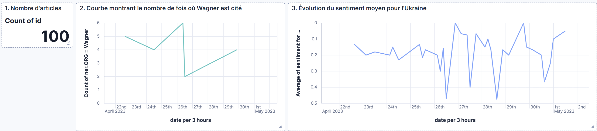
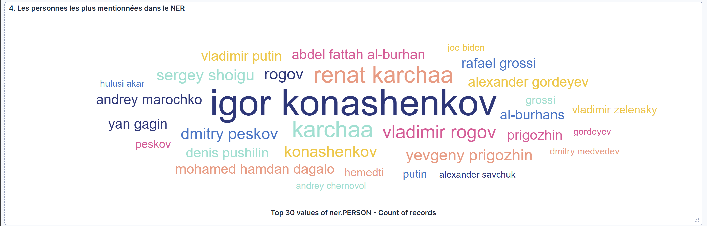
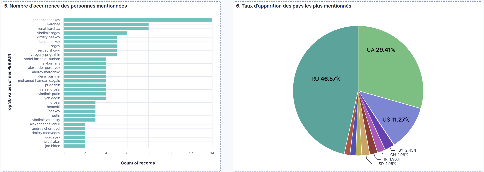
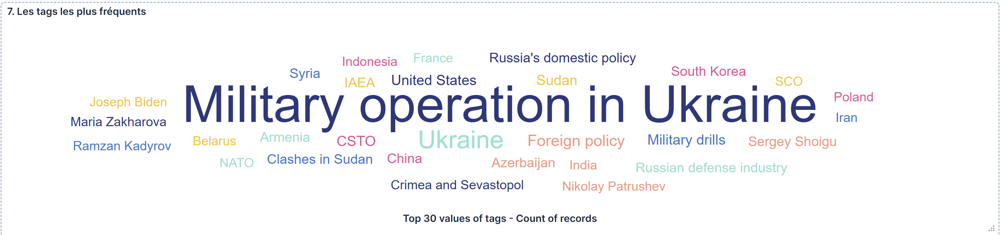
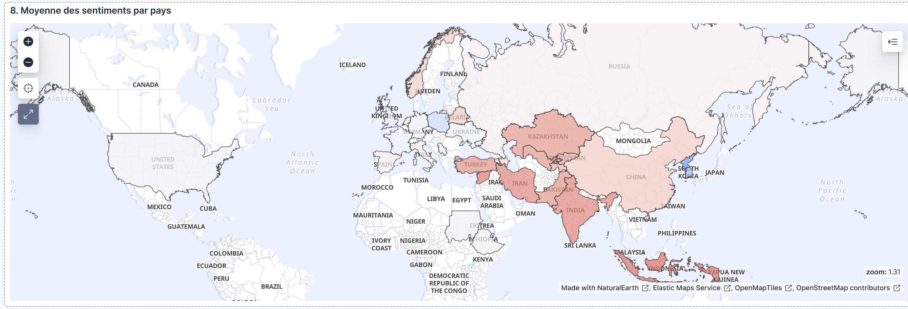
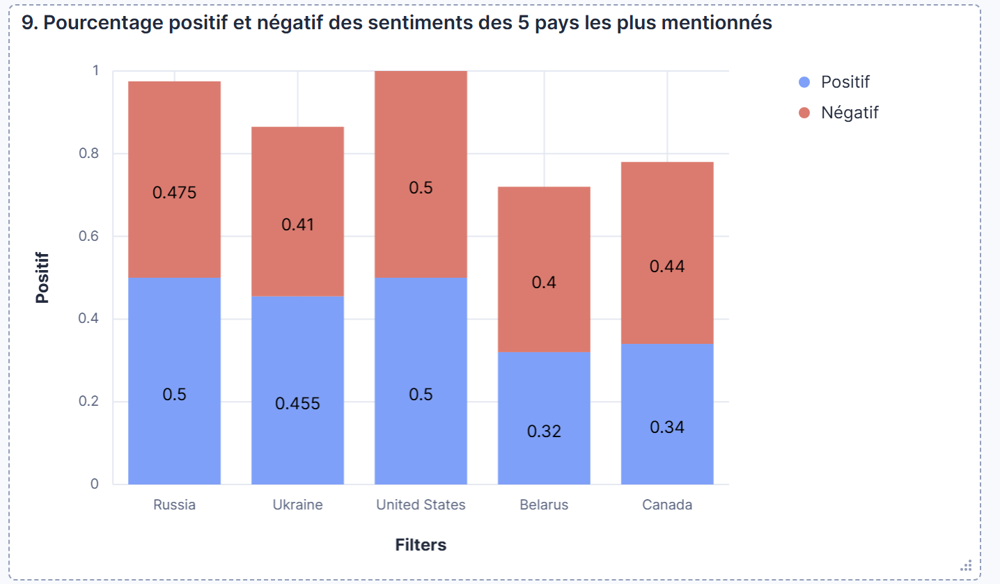

### Maintenant que cela est fait, on s'intéresse à présent aux **21 000 articles** pour lesquels on obtient le dashboard suivant :

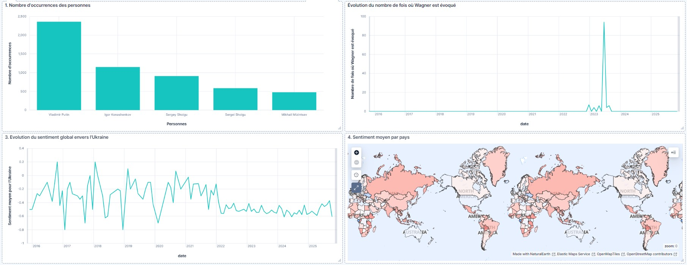
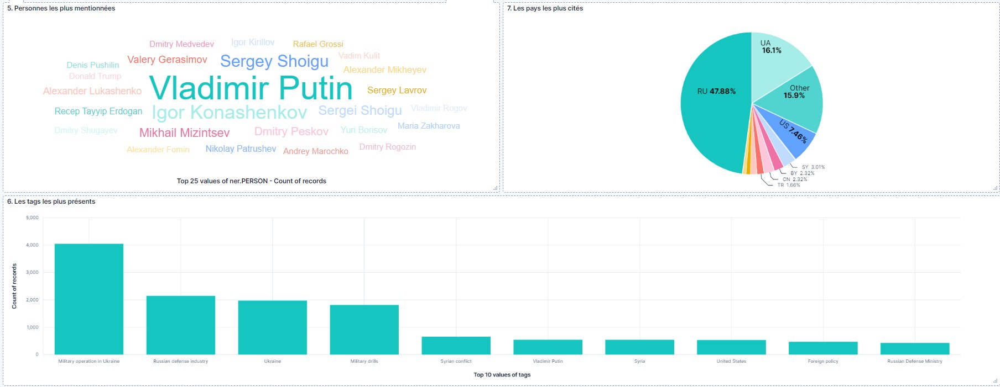
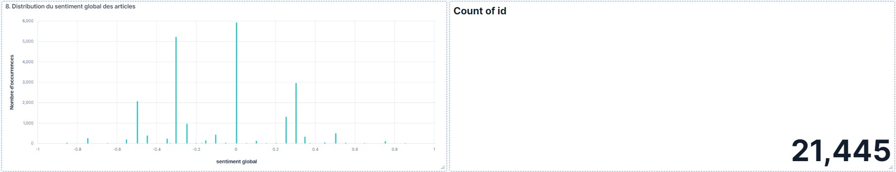

### Analyse

On relève tout d'abord un point intéressant concernant la guerre en Ukraine. En effet, si on s'intéresse à la courbe représentant l'évolution du sentiment global concernant l'Ukraine, on observe que le sentiment a toujours été plus négatif, mais on observe une dégradation à partir de la fin de 2021 et tout particulièrement à partir du début de la guerre :

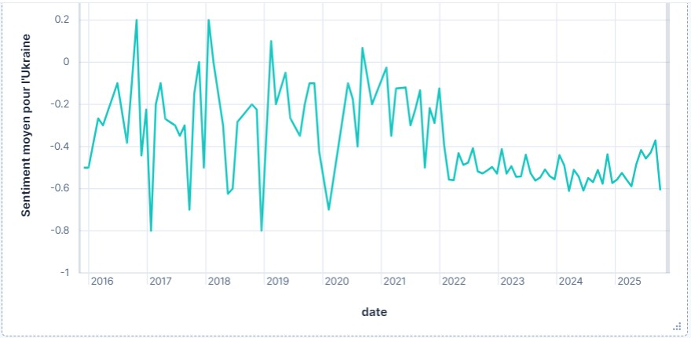

On peut aussi s'intéresser au sentiment par pays :

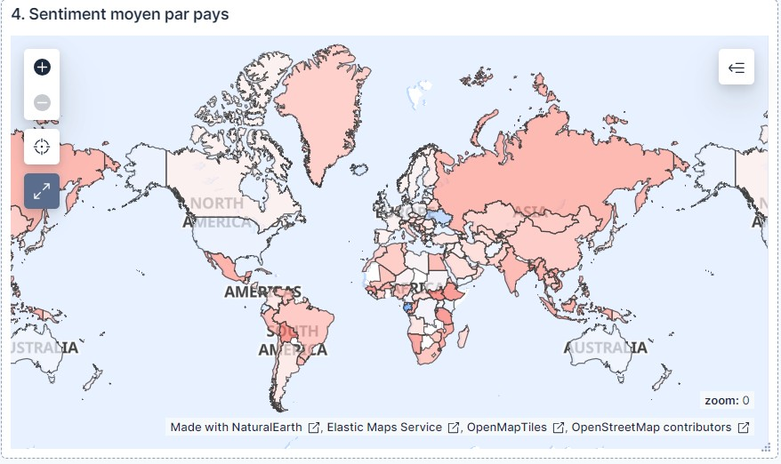

On observe notamment une rhétorique assez tournée à l'encontre des États-Unis, et dans une moindre mesure l'Europe.
La Russie est montrée sous une bonne lumière et les sentiments des pays avec lesquels la Russie entretient de bonnes relations, comme la Chine, ont une note relativement bonne (autour de 0.1 à 0.2 sur une échelle allant de -1 à 1).

### Point sur le nucléaire :

En analysant dans les articles la récurrence des sujets d'attaque ou frappe nucléaire, de sécurité et d'armes nucléaires, on obtient la courbe suivante : 

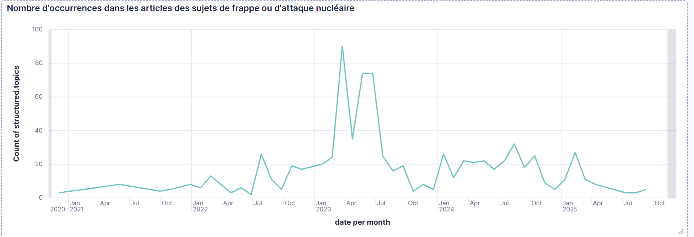

On remarque que c'est un sujet souvent discuté, mais qui a explosé en apparition pendant l'année 2023 en particulier. A l'heure d'aujourd'hui, on dénombre moins d'occurrences qu'avant la déclaration de la guerre contre l'Ukraine, ce qui laisse a penser que la Russie ne préparerait pas une attaque nucléaire imminente sur le pays voisin.

Lorsque les articles parlent de nucléaire, les organisations principales mentionnées sont les forces armées aériennes, spatiales et stratégiques russes. On voit ici sur cette courbe une diminution de leurs occurrences depuis 2024 qui va également dans le sens du graphe précédent.

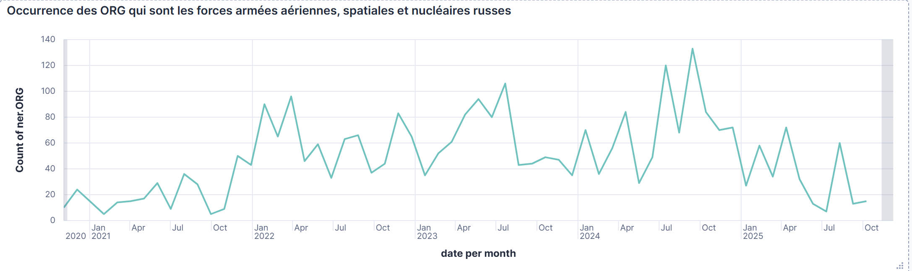
